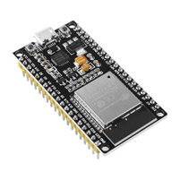
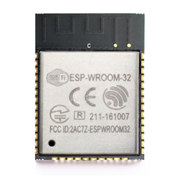
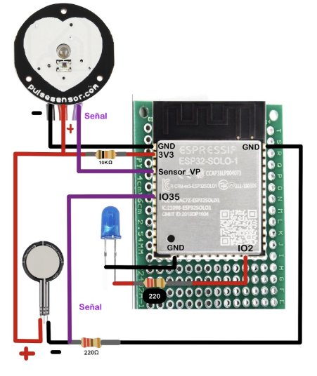
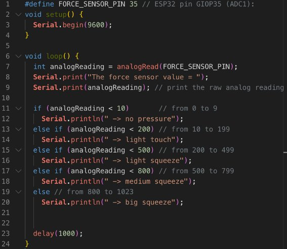

**MÓDULO COIL (COLLABORATIVE ONLINE INTERNATIONAL LEARNING)**

**UCAP-UNISABANA 2023-2**

*Sensores y Actuadores*

**UNIVERSIDAD CATÓLICA ¨NUESTRA SEÑORA DE LA ASUNCION¨**

*Facultad de Ciencias y Tecnología*
![ref1]![ref1]![ref2]![ref3]![ref3]![ref3]![ref2]																																																																																

**NewBorn Guardian**

**Presentan**

	

- *Iván Leguizamón* 
- *Josué Iberbuden*
- *Alejandro Acevedo* 
- *Robert González* 

**2023**
																													

**Introducción**

En el emocionante camino hacia la maternidad, es esencial garantizar la salud y bienestar tanto de la madre como del futuro recién nacido. Para abordar este crucial aspecto, surge el innovador proyecto "NewBorn Guardian". Este sistema integral de monitoreo de salud durante el parto combina tecnología de vanguardia con un enfoque centrado en el cuidado de la madre y el bebé.

La plataforma se basa en un microcontrolador Arduino, que actúa como el cerebro del sistema, interactuando con sensores especializados para medir la frecuencia cardíaca de la madre y del feto, así como las contracciones uterinas. Estos datos críticos se recopilan y procesan en tiempo real, permitiendo una evaluación precisa de la salud de ambos.

El NewBorn Guardian no solo se detiene en la recopilación de información vital, sino que también brinda un acceso sencillo y seguro a través de una interfaz web especialmente diseñada. Los datos se presentan de manera clara y comprensible, proporcionando a los profesionales de la salud y a los padres una visión detallada del progreso y bienestar durante el proceso de parto.

Así, "NewBorn Guardian" no solo representa una innovación tecnológica, sino también un salto hacia adelante en la atención y seguridad durante el parto. Al unir Tecnología 4.0, IoT y un enfoque centrado en el cuidado de la madre y el bebé, este proyecto redefine la experiencia del parto, brindando tranquilidad y confianza a las familias en este momento crucial de sus vidas.

**Contexto y Desafíos en la Atención Prenatal: Una Perspectiva Actual**

En la actualidad, la mortalidad materna asociada a complicaciones durante el embarazo o parto constituye un desafío significativo para la salud pública a nivel global. De acuerdo con la Organización Mundial de la Salud (OMS), se estima que aproximadamente 800 mujeres pierden la vida diariamente debido a estas complicaciones. Esta alarmante cifra subraya la urgente necesidad de soluciones efectivas y accesibles para abordar este problema y garantizar la salud y bienestar de las mujeres en edad reproductiva.

Los embarazos de alto riesgo representan una categoría especial de preocupación, siendo influenciados por diversos factores que incluyen condiciones de salud preexistentes en la madre, anomalías obstétricas y problemas de salud fetal. Estos factores aumentan la probabilidad de complicaciones durante el embarazo, exigiendo una atención y supervisión más rigurosa por parte de los profesionales de la salud.

La asfixia neonatal, una de las principales causas de muerte fetal, presenta consecuencias devastadoras para los recién nacidos que logran sobrevivir. Muchos de ellos desarrollan parálisis cerebral y enfrentan desafíos significativos en su desarrollo. De los aproximadamente 130 millones de nacimientos que ocurren a diario, se estima que 3.3 millones resultan en muertes fetales, y casi 4 millones de bebés fallecen durante el primer mes de vida. Este sombrío panorama subraya la necesidad crítica de intervenciones efectivas en el cuidado prenatal.

Es importante destacar que más de un tercio de las muertes neonatales son atribuibles a nacimientos prematuros y malformaciones congénitas. Estos eventos trágicos subrayan la complejidad y la gravedad de los desafíos que enfrentan los profesionales de la salud en la atención prenatal y neonatal.

Sin embargo, a pesar de los avances en la tecnología médica, las técnicas actuales de monitoreo prenatal enfrentan limitaciones significativas. La baja sensibilidad y especificidad, así como la relativa variabilidad en los criterios de interpretación, han llevado a que los profesionales de la salud no acepten completamente su uso. Estudios recientes también cuestionan la eficacia de ciertas técnicas, como la cardiotocografía, especialmente en mujeres con condiciones médicas preexistentes y otras complicaciones.

En respuesta a estas preocupaciones, el presente proyecto busca desarrollar una solución innovadora y accesible. Aprovechando los avances en Tecnología 4.0 e Internet de las Cosas (IoT), se propone un sistema electrónico basado en una red de sensores inalámbricos. Este sistema tiene como objetivo supervisar, controlar e informar en tiempo real sobre los niveles de frecuencia cardíaca y contracciones uterinas. Esta herramienta promete ser una invaluable ayuda para profesionales de la salud al brindar información precisa y oportuna para la toma de decisiones, así como fomentar investigaciones futuras en la prevención de complicaciones en embarazos de alto riesgo.

Entres los factores que incrementan el alto riesgo se encuentran la salud materna,anomalías obstétricas y enfermedades del feto , el la siguiente tabla se pueden visualizar la calificación del riesgo fetal.

**Monitoreo de frecuencia cardíaca fetal (FHR)**

El monitoreo de la frecuencia cardíaca fetal (FHR) ha adquirido una relevancia significativa en la práctica de ginecología y obstetricia durante las últimas dos décadas [6]. No obstante, es importante tener en cuenta que este monitoreo, que generalmente se realiza en las etapas finales del embarazo, no proporciona una evaluación completa del riesgo fetal. Su interpretación debe realizarse considerando el contexto del embarazo y la información clínica de la paciente. La siguiente tabla presenta los patrones y posibles anomalías que pueden detectarse a partir de la variabilidad de la frecuencia cardíaca.

|**Patrón**|**Interpretación**|
| - | - |
|Patrón normal|Variabilidad de la FHR dentro de los límites normales.|
|Bradicardia leve|FHR menor a 110 latidos por minuto.|
|Bradicardia severa|FHR menor a 80 latidos por minuto.|
|Taquicardia leve|FHR mayor a 160 latidos por minuto.|
|Taquicardia severa|FHR mayor a 180 latidos por minuto.|
|Variabilidad disminuida|Variabilidad de la FHR reducida o ausente.|
|Deceleraciones tempranas|Disminución gradual de la FHR en relación con las contracciones uterinas.|
|Deceleraciones tardías|Disminución de la FHR después del inicio de las contracciones uterinas.|
|Deceleraciones variables|Disminución abrupta y variable de la FHR.|

Estos datos proporcionan una visión detallada de los diferentes patrones y posibles anomalías que pueden observarse en el monitoreo de la frecuencia cardíaca fetal, lo que facilita la interpretación clínica y contribuye a una atención prenatal más precisa y efectiva. 

**Sistemas comerciales de adquisición de datos para medir la frecuencia cardiaca.**

En el mundo los centros de salud desean aprovechar la tecnología y dentro del área de la salud la telemedicina es una gran oportunidad para el cuidado preventivo del ser humano y de esta manera registrar el estado del paciente y alertar a su médico de forma oportuna, la aplicación de este trabajo se enfoca a la frecuencia cardiaca para generar una base de datos acerca del comportamiento y así ofrecer una ayuda personalizada. De acuerdo al avance de la tecnología existen diversos sensores en el mercado que permiten la comunicación entre el ser humano - dispositivos inteligentes y viceversa, llevando a cabo una supervisión a distancia, ofreciendo servicios en el área de salud de forma rápida y efectiva, minimizando los tiempos de respuesta en casos emergentes

Para determinar el sensor más adecuado se definieron algunos requerimientos entres estos la capacidad de supervisión la frecuencia cardiaca, inalámbrico, el consumo de energía, que sea compatible con el sistema operativo, el precio, todos estos parámetros se vieron reflejados en la siguiente tabla.  

	

**NewBorn Guardian (NBG)**

**SISTEMA DE CONTROL PARA EMBARAZOS DE RIESGO**

**Objetivo** 

El presente trabajo  busca implementar un prototipo (IoT) de bajo costo, fácil colocación y manipulación para la supervisión y aviso de alteración en la frecuencia cardiaca de las mujeres en estado de gestación y sus miembros fetales. 

**Funcionamiento** 

Consta de un módulo cuyo procesador central se basa en un microcontrolador ESP32, que se encarga de recolectar la información y compartir la información en una base de datos que se encuentra en la web. Genera mensajes de aviso por la red celular a un dispositivo móvil si los rangos de frecuencia cardiaca exceden de los normales que va de 80 Lpm – 100 Lpm en la madre y de 120 Lpm - 160 Lpm para el miembro fetal.

El prototipo está asociado a una página web que permite el ingreso, búsqueda y visualización de información relacionada con médicos y gestantes, mantiene un historial de las variaciones de la frecuencia cardiaca tanto de la madre y miembro fetal. Es administrada por medio de claves de acceso y códigos de seguridad. 

De las pruebas realizadas, con ayuda de especialistas del área, al ser comparado con equipos médicos comerciales de similares características se comprobó que el prototipo tiene un margen de error de 2 Lpm a 3 Lpm para la variable de frecuencia cardiaca tanto en madre como en el miembro fetal. Se concluye que el prototipo puede ser considerado como una herramienta de supervisión y ayuda para el control permanente en gestantes de alto riesgo.

**Objetivos específicos** 

- Estudiar cuales son las principales variables fisiológicas y parámetros clínicos que se evalúan en un embarazo.
- Identificar los requerimientos necesarios para el prototipo electrónico.
- Seleccionar los dispositivos electrónicos y sensores que se acoplen a los requerimientos del prototipo.
- Establecer el medio de comunicación inalámbrico entre nodos más adecuado al diseño 
- Evaluar diferentes módulos de comunicaciones para el envío remoto del dispositivo y seleccionar uno de estos.
- Caracterizar los requerimientos que debe cumplir el dispositivo de telemonitoreo.
- Digitalizar los parámetros clínicos por medio del sistema embebido y almacenarlos en el dispositivo.
- Asegurar un envío de datos de manera remota a un computador donde se visualicen los datos por medio de una interfaz sencilla.

**Relevancia científica de este trabajo**

Detección de la pérdida de bienestar fetal del anteparto. Los métodos tradicionales actuales de monitoreo fetal solo se basan en el análisis de la señal cardiotocográfica y en mayor parte su uso está limitado al monitoreo durante la labor de parto. 

La detección temprana de la pérdida de bienestar fetal permitirá que el embarazo llegue a buen término, reduciendo el riesgo de que el feto sufra de hipoxia, restricción de crecimiento intrauterino o incluso la muerte.

**A) Monitoreo de embarazos de alto riesgo.** 

La detección oportuna del estado de bienestar del feto en mujeres embarazadas de alto riesgo es una importante área de investigación, en donde la interdisciplinariedad es vital para desarrollar aplicaciones tecnológicas robustas para reducir una de las principales causas de mortalidad en mujeres.

` `**B) Nuevos descriptores.** 

La propuesta de incluir el uso de nuevos descriptores obtenidos del análisis de la actividad eléctrica cardiaca del feto, mejorará la sensibilidad y la especificidad de la detección del estado de bienestar fetal, introduciendo un sistema de detección más robusto y mejorando precisión 

**Justificación** 

El desarrollo de un sistema de monitoreo de frecuencia cardíaca fetal y movimiento fetal a través de una red de sensores inalámbricos surge como una respuesta crucial ante la problemática global de la mortalidad materna y fetal, así como las complicaciones asociadas al embarazo de alto riesgo. La Organización Mundial de la Salud (OMS) señala que las complicaciones en el embarazo y el parto representan la principal causa de muerte entre mujeres en edad reproductiva a nivel mundial, con un estimado de 800 decesos diarios. Además, la asfixia neonatal y otras complicaciones obstétricas siguen siendo una amenaza significativa para la salud neonatal, con millones de recién nacidos en riesgo cada año.

A pesar de los avances tecnológicos en el campo de la obstetricia, las técnicas de monitoreo actuales muestran limitaciones en términos de sensibilidad y especificidad, lo que dificulta una detección temprana y precisa de posibles complicaciones. Esto, junto con la falta de accesibilidad a equipos especializados debido a su alto costo, subraya la urgencia de desarrollar soluciones innovadoras y asequibles que mejoren la atención prenatal y reduzcan los riesgos para las madres y sus bebés.

El presente proyecto se fundamenta en la convergencia de la Tecnología 4.0 y el Internet de las Cosas (IoT), aprovechando la capacidad de los sensores inalámbricos y la interconexión de dispositivos para proporcionar un monitoreo continuo y en tiempo real de la frecuencia cardíaca fetal y el movimiento del feto. Esta innovación no solo tiene el potencial de salvar vidas al detectar de manera temprana posibles complicaciones, sino que también ofrece una herramienta invaluable para la toma de decisiones médicas informadas y la realización de futuras investigaciones en el campo de la obstetricia.

**DISEÑO DEL HARDWARE Y SOFTWARE DEL PROTOTIPO DEL SISTEMA DE SUPERVISIÓN EN TIEMPO REAL DE MUJERES EN ESTADO DE GESTACIÓN**

` `**Requerimientos del diseño**

Basado en el estudio se realiza la definición de los requerimientos del diseño que debe satisfacer y cumplir el prototipo electrónico basado en redes inalámbricas para la supervisión en tiempo real de mujeres en estado de gestación. Que son: 

- Supervisión en tiempo real del pulso cardiaco de la madre.  
- Supervisión en tiempo real del pulso cardiaco del miembro fetal.   
- Emitir mensajes de alerta cuando el pulso cardiaco se vea alterado y fuera del rango específico de la pulsación cardiaca. Siendo un sistema que se apoya en una red celular y poder emitir un mensaje de alerta a uno o varios teléfonos móviles. 
- Ser de fácil instalación, de operación independiente y de bajo costo, pero competitivo con equipos comerciales de iguales características.   

**Módulo de Supervisión**

Posee como función principal monitorear y transmitir la información proveída por los sensores en tiempo real, y medir la variable de frecuencia cardiaca de la mujer en estado de gestación. 

Permite transmitir y visualizar la información a los módulos del sistema mediante la radiofrecuencia (RF) o de manera directa a una computadora, esto permite simplificar el ingreso de los datos tales como el código de la paciente, números para el envío de SMS de alerta tanto del doctor como de los familiares. Para la adquisición de los datos se requiere de sensores para medir el pulso cardiaco de la mujer embarazada, así como al miembro fetal. 

**Etapa de recolección** 

Esta encargada de almacenar todas las lecturas trasmitidas por RF desde el módulo de supervisión. El almacenamiento y visualización en una base de datos que estará en la web donde se conectará 19 el módulo con el servidor para la trasmisión de los datos obtenidos de los sensores de pulso cardiaco al detectar una variación en el rango de la frecuencia cardiaca de la madre y del feto. De esta manera que la paciente no requiere acceder al módulo para la adquisición de los datos censados. Está integrado por un TX GPS, un dispositivo de recolección de información, un circuito de procesamiento y una fuente de alimentación. 

**Etapa de Aviso** 

Es el responsable de recolectar la información y lecturas transmitidas por RF del módulo de supervisión, los valores para determinar si sobrepasa el límite máximo o mínimo permitido por el cuerpo humano. De ser así genera un aviso que es enviado mediante la red de uno o varios teléfonos móviles anteriormente establecidos. En él se establece la hora, el código de la paciente y el aviso de alerta.

**Diseño de la arquitectura del módulo del sistema** 

Una vez determinados los requerimientos del diseño y concebir la arquitectura de se procede a presentar los diseños de cada uno de los módulos requeridos por el sistema.

**Módulo de supervisión**   

Dos de los bloques constan de sensores que se encargan de la trasmisión del pulso cardiaco de la madre y el miembro fetal. El bloque de procesamiento recepta la información de los sensores y la transmite al bloque de visualización. La misma información es enviada de igual manera al bloque de trasmisión RF para ser envida a los distintos módulos restantes.

` `**Etapa del proceso de Recolección de datos** 

**Etapa del proceso aviso** 

**Diagrama de flujo del programa principal del módulo**

**Componentes Necesarios:** 

**Sensor de Frecuencia Cardiaca**

El ritmo cardíaco juega un papel crucial en el monitoreo fetal, siendo la primera indicación vital para evaluar el estado del feto. Los sensores de pulso cardíaco se destacan por su facilidad de manipulación y operación. Son altamente adaptables a cualquier sistema debido a sus terminales y características, que se especifican en la

` 	`**Especificaciones del Sensor de Pulso Cardíaco**

|**Terminales**|**1 analógico, GND, VCC**|
| - | - |
|Alimentación|3V o 5V|
|Consumo de Corriente|4 mA|
|Extensión del Sensor|15 cm|
|Modo de Uso|Conectado al Arduino|
|Realizado por|Flores, Alex, 2018|
|Fuente|(Guía, 2015)|

` `Se seleccionó el sensor de pulso cardíaco detallado en la debido a su forma, características y su versatilidad para asegurar la recopilación de datos de la manera más precisa y práctica posible. Será ubicado en el abdomen y vientre de la mujer embarazada.

**Sensor de presión (Sensor de contracciones uterinas)**

**Sensor FlexiForce A201**

El sensor FlexiForce A201 es un dispositivo de medición de fuerza resistivo producido por Tekscan. Diseñado para medir fuerzas aplicadas, este sensor es conocido por su alta sensibilidad y precisión en la detección de cambios en la presión o fuerza ejercida sobre su superficie. Su construcción flexible y su capacidad para adaptarse a diferentes superficies lo hacen versátil y adecuado para una amplia gama de aplicaciones que requieren medición de fuerza.

**Especificaciones del Sensor FlexiForce A201**

|**Característica**|**Valor**|
| - | - |
|Rango de Medición|Hasta 4,448 N (1,000 lb)|
|Resistencia a Sin Carga|>1 MΩ|
|Corriente Máxima Recomendada|2\.5 mA|
|Voltaje de Accionamiento|Ajustable (Ver Datasheet)|
|Tipo de Conector|3-pin Male Square Pin (Pin central inactivo)|
|Fabricante|Tekscan|

**Funcionamiento para Medir Contracciones Uterinas**

El sensor FlexiForce A201 es especialmente apto para medir contracciones uterinas debido a su capacidad para detectar y medir fuerzas aplicadas con precisión. Al colocar el sensor en el área donde se espera que se produzcan las contracciones, este puede registrar los cambios en la presión ejercida por el útero durante el trabajo de parto. Al ajustar el voltaje de accionamiento y la resistencia de retroalimentación según sea necesario, el sensor puede adaptarse para proporcionar mediciones precisas en el rango de fuerzas típicamente asociado con las contracciones uterinas.

**Razones para Implementar el FlexiForce A201 en el Proyecto**

1. **Alta Sensibilidad y Precisión**: El FlexiForce A201 es conocido por su capacidad para detectar incluso pequeñas variaciones en la presión o fuerza, lo que lo convierte en un candidato ideal para la medición de contracciones uterinas.
1. **Adaptabilidad a Superficies**: Su construcción flexible permite que se adapte a diferentes superficies anatómicas, lo que es esencial para un monitoreo preciso en aplicaciones médicas.
1. **Capacidad de Ajuste de Sensibilidad**: La posibilidad de ajustar el voltaje de accionamiento y la resistencia de retroalimentación permite una personalización óptima para las necesidades específicas del proyecto.
1. **Bajo Consumo de Corriente**: Con un consumo de corriente máximo de 2.5 mA, el sensor es eficiente en términos de energía, lo que lo hace compatible con fuentes de alimentación de baja potencia, como baterías.

Al implementar el FlexiForce A201 en un proyecto de monitoreo de contracciones uterinas, se puede confiar en la sensibilidad y precisión de este sensor para proporcionar mediciones confiables y valiosas durante el proceso de trabajo de parto.

**Microcontrolador o Microprocesador:**

***ESP32***        	

El ESP32 es un microcontrolador de bajo costo y bajo consumo de energía que incluye capacidades de conectividad Wi-Fi y Bluetooth. Está diseñado para aplicaciones de Internet de las Cosas (IoT) y es muy popular en el mundo del desarrollo de hardware y proyectos DIY.

**Componentes y Características:**

1. **Procesador Dual-Core:** El ESP32 tiene dos núcleos de procesador Tensilica Xtensa LX6, lo que le brinda una mayor potencia de procesamiento.
1. **Wi-Fi y Bluetooth:** Incluye un módulo de conectividad Wi-Fi y Bluetooth que permite la comunicación inalámbrica con redes y dispositivos.
1. **Memoria Flash:** Viene con una cantidad de memoria flash incorporada que puede variar según el modelo, pero generalmente es suficiente para almacenar firmware y datos.
1. **RAM:** Tiene una cantidad de RAM disponible para la ejecución de programas y almacenamiento de datos temporales.
1. **GPIO (Pines de E/S):** El ESP32 tiene una variedad de pines de entrada/salida (GPIO) que pueden utilizarse para conectar sensores, actuadores y otros dispositivos.
1. **Interfaces de Comunicación:** Además de Wi-Fi y Bluetooth, el ESP32 también tiene interfaces para comunicación serie, SPI, I2C y más, lo que lo hace compatible con una amplia variedad de periféricos y sensores.
1. **ADC y DAC:** El ESP32 incluye convertidores analógico-digitales (ADC) y digitales-analógicos (DAC) para interactuar con el mundo analógico.

**Funcionamiento:**

El ESP32 se programa utilizando el entorno de desarrollo de Arduino o herramientas específicas de Espressif (el fabricante del ESP32). Los desarrolladores escriben código en C++ o en un lenguaje similar a C, utilizando librerías proporcionadas por la comunidad o por el fabricante.

El microcontrolador puede ejecutar código directamente en sus núcleos o utilizar hilos (threads) para manejar múltiples tareas de manera concurrente.

**Aplicaciones Típicas:**

El **ESP32** es versátil y se utiliza en una amplia gama de aplicaciones de IoT y proyectos embebidos. Algunos ejemplos comunes incluyen:

` `**Dispositivos de Monitoreo y Control Remoto:** Debido a su conectividad Wi-Fi y Bluetooth, el ESP32 es ideal para crear dispositivos que se puedan controlar y monitorear de forma remota a través de una red.

` `**Sistemas de Automatización del Hogar:** Puede utilizarse en proyectos de automatización del hogar para controlar luces, termostatos, cerraduras, etc.

` `**Sensores de Monitoreo Ambiental:** El ESP32 puede conectarse a una variedad de sensores para medir cosas como temperatura, humedad, calidad del aire, etc.

**Robótica y Control de Motores:** Puede utilizarse para controlar motores y realizar tareas de robótica.

**Conectividad IoT:**

***Módulo GSM/GPRS SIM900***

El **Módulo GSM/GPRS SIM900** desempeña un papel central en el sistema de monitoreo propuesto. Sus características principales se detallan en la tabla. Este módulo ofrece una amplia gama de capacidades, incluyendo la transmisión de datos a través de los protocolos más relevantes, capacidad para realizar y recibir llamadas, envío y recepción de mensajes SMS, así como seguimiento por GPS. Además, es compatible con plataformas de hardware libre. Físicamente, consta de una antena y una ranura para SIM, lo que facilita su conexión a cualquier red móvil e internet a través de cualquier operador. Todas estas funcionalidades se implementan de forma inalámbrica.

**Características del Módulo de Comunicación GSM/GPRS SIM900**

|**Característica**|**Detalle**|
| - | - |
|Compatible con Arduino|Conexión a través del puerto serial|
|Bandas Soportadas|Quad-Band 850/900/1800/1900 Mhz|
|Capacidad GPRS|Multi-slot Clase 10/8|
|Clase de Estación Móvil GPRS|Clase B|
|Compatibilidad GSM|Fase 2/2+|
|Potencia de Transmisión GSM|Clase 4 (2 W a 850/900 Mhz), Clase 1 (1 W a 1800/1900 Mhz)|
|Protocolos de Comunicación|TCP/UDP embebido|
|Consumo de Energía|1\.5 mA|
|Funcionalidad Adicional|Soporte RTC, Bandeja para SIM|

Este módulo se destaca por proporcionar una interfaz de comunicación inalámbrica eficiente y confiable en el contexto específico de este proyecto de monitoreo fetal durante el embarazo. La elección de este componente se basa en su capacidad para integrarse sin inconvenientes en el sistema, permitiendo la transmisión de datos vital para el seguimiento y control de la salud tanto de la madre como del feto. Su compatibilidad con plataformas de hardware libre facilita la integración en el proyecto, y su eficiencia en el consumo de energía contribuye a una operación sostenible y confiable. Esto hace del Módulo GSM/GPRS SIM900 una elección eficaz para este proyecto de monitoreo de alto riesgo.

**Fuente de Alimentación:**

***Power Bank***

En la Tabla se especifica la fuente de alimentación del sistema, la cual consiste en una batería externa de larga duración y corriente estable. Esto garantiza una estabilidad en el prototipo y asegura la obtención de mediciones de supervisión precisas por parte del dispositivo. Los sensores operan con un consumo de corriente de 3,7 mA \* 2, el GPRS utiliza 1,5 mA y el Arduino consume 27 mA. Al estar conectado al GPRS, el consumo total es de 35 mA. La capacidad de la batería de litio es de 3800 mA, lo que asegura el suministro total al sistema para el funcionamiento adecuado y la toma de resultados de la frecuencia fetal (Banggood).

**Fuente de Alimentación del Sistema de Supervisión**

|**Fuente de Energía**|**Power Bank**|
| - | :-: |
|Voltaje|3\.7 V|
|Corriente|3800 mA|
|Funcionalidades Adicionales|Interruptor de reanudación de carga, Salida doble de USB, Actúa con Arduino, Raspberry, Android y otros dispositivos eléctricos de carga|
|Puerto de Entrada de Alimentación de la Batería|Indicadores de carga, encendido y apagado|

La elección de esta fuente de alimentación se basa en su capacidad para proporcionar una corriente estable y de larga duración, asegurando así el funcionamiento óptimo del sistema de monitoreo

**PLATAFORMA DE MONITOREO EN LÍNEA**

`	`Diseñar una solución para mejorar la monitorización remota de embarazadas de alto riesgo y sus fetos durante el trabajo de parto en hospitales de América Latina es un desafío importante que podría marcar la diferencia en la atención médica y reducir los riesgos para estas pacientes. Con esta plataforma y este proyecto tendremos en cuenta los siguientes aspectos:

1. Sistema y dispositivo de monitoreo móvil o portátil.
1. Conectividad efectiva de datos, que pueda funcionar en áreas con conexión de internet limitada.
1. Seguridad y privacidad de datos.
1. Accesibilidad.
1. Evaluación continua del paciente.

Al diseñar esta solución, es esencial considerar la infraestructura tecnológica disponible, los recursos médicos y las necesidades específicas de la población de América Latina. La colaboración con expertos en salud y tecnología, así como con las comunidades locales, será fundamental para el éxito de esta iniciativa.

`	`La aplicación ayudará a analizar cada caso basándose en los síntomas que presenten las mujeres durante su embarazo, con la finalidad de que, en caso de ser necesario, reciban un monitoreo adicional, así como tratamientos necesarios que ayuden a prevenir que tengan un parto prematuro.

Nuestro objetivo fue desarrollar una herramienta fiable y validada que incorporara la medición mejorada de factores de riesgo relevantes para predecir el parto prematuro espontáneo (PPE) en mujeres asintomáticas con alto riesgo de parto prematuro.

Este sistema de control a través de una APP estará interconectada al prototipo por medio del módulo ESP32 con wifi y bluetooth, que es un dispositivo eficiente y económico para la realización de proyectos de IoT. Usando el microcontrolador de 32 bits que funciona a 80MHz y en lugar de usar comandos AT lo que hace del código más largo,  usaremos la librería del cliente HTTP de Arduino para que el código sea más fácil y el método POST que usa datos encriptados y es más seguro. Junto con eso crearemos una plataforma web y una base de datos donde manejaremos y controlaremos las variables y parámetros relacionados a cada paciente.

**ADAPTACIÓN DEL MICROCONTROLADOR**

Para hacer de la implementación del proyecto y del dispositivo un poco más accesible en cuánto a costo sin perder la eficiencia y calidad de medición, trabajamos solamente con la placa ESP32, sin necesidad de utilizar la placa de desarrollo completa, a continuación veremos ambas imágenes para diferenciar una de otra:

`                    `

`                 `Placa ESP32                          Placa de desarrollo ESP32

`	`Decidimos utilizar sólo la placa ESP32 ya que es más pequeña y no necesitaremos el resto de componentes que trae la placa de desarrollo, como por ejemplo, el programador FTDI, los botones de boot y enable, toda la cantidad de los pines machos, pues, todo lo que necesitaremos es el regulador de voltaje de 3.3V y las resistencias pull-up.

`	`Cabe destacar que la diferencia de costo entre ambos elementos es bastante, ya que, la placa de desarrollo ESP32 cuesta alrededor de 200.000 Gs, mientras que la placa ESP32 sola cuesta alrededor de 20.000 Gs, lo que aumenta considerablemente la accesibilidad económica del proyecto.

`	`Continuando con la implementación del ESP32, tenemos esta configuración mínima en la que usamos las resistencias pull-up y el regulador 3.3V:

![ref4]

esta configuración consiste en colocar una resistencia pull-up en el pin enable y otra en el pin GPIO-0 o flash. para subir los códigos usamos un módulo de programación externo universal FTDI serial Arduino, cuyo costo es aproximadamente de 30.000 Gs.

![ref4]

Este módulo programador sólo lo necesitamos cuando subimos el código o hacemos pruebas, no irá dentro del circuito del dispositivo final, lo que nos ayuda a ocupar el menor espacio posible en la adaptación de la placa al dispositivo final.

**ADAPTACIÓN DE SENSORES AL MICROCONTROLADOR**

**PROGRAMANDO EL ESP32 CON IDE ARDUINO**

`	`Como en la placa de desarrollo del ESP32 existen los botones de enable y boot para iniciar el proceso de carga, componentes que en nuestro caso, evitamos para reducir el espacio del circuito, usaremos los pines DTR y RTS del programador FTDI, para ello, podemos utilizar una placa PCB perforada para ir agregando los componentes y armar el circuito con los correspondientes sensores y demás cosas. De esta manera, soldamos el ESP32 a la placa perforada y añadimos las resistencias de pull-up como también un LED en el puerto GPIO-2 para la realización de pruebas. Conectamos el módulo FTDI, uniendo las terminales RX a TX, TX a RX, el pin DTR al GPIO-0 y el pin RTS al pin de habilitación, como vemos a continuación:

A continuación, conectamos el cable USB, y nos aseguramos que se instalen correctamente los controladores del serial de la placa ESP32. para que el ESP32 funcione con Arduino, abrimos el IDE Arduino, e instalamos la placa ESP32. luego, tenemos que asegurarnos de que las configuraciones sean las siguientes:

1. BOARD: ESP32.
1. UPLOAD SPEED: 921600.
1. CPU FREQUENCY: 240MHz (Wifi/BT).
1. FLASH FREQUENCY: 80MHz.
1. FLASH MODE: QIO.
1. FLASH SIZE: 4MB (32Mb).
1. PARTITION SCHEME: Default 4MB with spiffs (1.2MB APP/1.5MB SPIFSS).
1. CORE DEBUG LEVEL: None.
1. PSRAM: Disabled.

Luego, escribimos este código de comprobación en la interfaz de IDE Arduino:

![ref5]

como habíamos conectado el LED en el pin digital 2, en la interfaz de Arduino seleccionamos el COM correspondiente del ESP32, cargamos el código a la placa y listo. Comprobamos el funcionamiento y la conexión de la placa mediante el parpadeo del LED.

![ref5]                  

**PROGRAMACIÓN DEL SENSOR FLEXIFORCE CON ARDUINO IDE**

**PROGRAMACIÓN DEL SENSOR DE FRECUENCIA CARDIACA CON ARDUINO IDE**

from machine import Pin, ADC

from time import sleep

Sensor1 = ADC(Pin(34))

Buzzer = Pin(2, Pin.OUT)

Sensor1.atten(ADC.ATTN\_11DB)

Sensor1.width(ADC.WIDTH\_12BIT)

while true:

` `Valor = Sensor1.read()

` `Voltaje = (3.3/((2^\*\*12)-1))^\*Valor #editar los asteriscos como asteriscos exponentes

` `print(Voltaje)

` `if(Voltaje mayor a 2): #editar mayor a por el simbolo

`   `Buzzer.value(True)

` `else:

`   `Buzzer.value(False)

` `sleep(0.025)

**Desarrollo de la Interfaz de monitoreo**

**Desarrollo de la Interfaz**

En esta etapa del proyecto, nos enfocamos en la creación de una interfaz visual que permita mostrar de manera clara y accesible los datos captados por los sensores de frecuencia cardíaca fetal y movimiento fetal. Para llevar a cabo este proceso, utilizamos Visual Studio Code, una potente herramienta de desarrollo de código fuente que ofrece un entorno de trabajo intuitivo y altamente personalizable.

**Visual Studio Code: Un Vistazo**

Visual Studio Code (VS Code) es un editor de código fuente de código abierto desarrollado por Microsoft. Se ha convertido en una opción popular para programadores y desarrolladores debido a su versatilidad, facilidad de uso y amplia comunidad de usuarios y extensiones. Su interfaz limpia y funcional proporciona un entorno de trabajo eficiente para escribir, editar y depurar código.

**Tecnologías Utilizadas**

Para el desarrollo de la interfaz, utilizamos HTML (HyperText Markup Language) y CSS (Cascading Style Sheets), dos lenguajes fundamentales en la construcción de páginas web. HTML nos permitió estructurar la información y los elementos de la página, mientras que CSS se encargó de la presentación y el diseño, asegurando una visualización atractiva y organizada.

**Importancia de una Interfaz Sencilla y Efectiva**

Optamos por diseñar una interfaz sencilla pero efectiva para garantizar la accesibilidad y comprensión de los datos para todo tipo de usuarios, incluidos profesionales de la salud y usuarios finales. La simplicidad de la interfaz permite una rápida interpretación de los valores de frecuencia cardíaca y movimiento fetal, evitando la saturación de información y facilitando la toma de decisiones.

Lectura de niveles normales

`	`Lectura de niveles anormales

**Relevancia en el Ámbito Médico**

La implementación de esta interfaz tiene un impacto significativo en el ámbito médico. Permite a los profesionales de la salud acceder de manera rápida y precisa a la información vital sobre el estado del feto y la madre. Esta herramienta se convierte en una aliada invaluable en la detección temprana de posibles complicaciones, lo que puede resultar crítico para la salud y bienestar de ambos.

Además, al brindar la capacidad de monitoreo en tiempo real y la posibilidad de almacenar históricos de datos, esta interfaz facilita el seguimiento y análisis a lo largo del tiempo, contribuyendo a una atención prenatal más efectiva y personalizada.

En conclusión, la creación de esta interfaz representa un paso crucial en la convergencia de tecnología y salud, proporcionando una herramienta poderosa para el monitoreo prenatal. Su simplicidad, combinada con su impacto potencial en la detección temprana de complicaciones, la convierte en una contribución significativa al campo de la obstetricia y la atención prenatal.

**Conclusión**

El desarrollo de esta plataforma de monitoreo prenatal representa un avance significativo en la integración de tecnología y atención médica. La combinación de sensores de frecuencia cardíaca fetal y movimiento fetal, junto con una interfaz intuitiva y accesible, ofrece un recurso valioso para el seguimiento y cuidado de embarazos de alto riesgo.

La simplicidad de la interfaz no solo garantiza una experiencia amigable para el usuario, sino que también agiliza la interpretación de los datos, proporcionando a los profesionales de la salud una herramienta efectiva para la detección temprana de posibles complicaciones. Además, la posibilidad de almacenar y analizar datos a lo largo del tiempo brinda una perspectiva invaluable sobre el progreso y la salud del feto y la madre.

Esta plataforma no solo se destaca por su funcionalidad, sino también por su potencial para democratizar el acceso a tecnologías de monitoreo prenatal. Al ofrecer una solución de bajo costo y fácil implementación, se supera la barrera financiera que a menudo limita el acceso a este tipo de herramientas.

En última instancia, este proyecto representa un paso adelante en la búsqueda de soluciones innovadoras y asequibles para mejorar la salud materno-fetal. Al unir la tecnología de vanguardia con la atención médica, se abre un nuevo horizonte de posibilidades para la prevención y el cuidado de complicaciones durante el embarazo, contribuyendo así a un futuro más seguro y saludable para madres e hijos.

**BIBLIOGRAFÍA**

1. Torres, A., & Nieto, J. J. (2006). Fuzzy logic in medicine and bioinformatics. BioMed Research International, 2006.
1. Beraldo, Kyoshi. 2014. Aconselhamento Genético Diagnóstico Prenatal. Aconselhamento Genético Diagnóstico Prenatal
1. Caballero, Gladys Maria Lovo. 2015. in. [En línea] 16 de febrero de 2015. [Citado el: 03 de junio de 2018.] https://es.slideshare.net/Dra\_Lovo/monitoreo-fetal-electronico-44736036. Cambios fisiológicos y anatómicos de la mujer en el embarazo. Ampliación del tema 53 del volumen 2 de Matronas del Servicio Andaluz de Salud, págs. 7-14.
1. Embarazo, Asociación América del. 2015. La Muerte Fetal: Tratar De Entender. La Muerte Fetal: Tratar De Entender. [En línea] 08 de 2015. http://americanpregnancy.org/es/pregnancy loss/stillborn-trying-to-understand/.

[ref1]: Aspose.Words.cbe62814-e4e7-452a-ba7b-9564beecf994.002.png
[ref2]: Aspose.Words.cbe62814-e4e7-452a-ba7b-9564beecf994.007.png
[ref3]: Aspose.Words.cbe62814-e4e7-452a-ba7b-9564beecf994.008.png
[ref4]: Aspose.Words.cbe62814-e4e7-452a-ba7b-9564beecf994.028.jpeg
[ref5]: Aspose.Words.cbe62814-e4e7-452a-ba7b-9564beecf994.032.png
